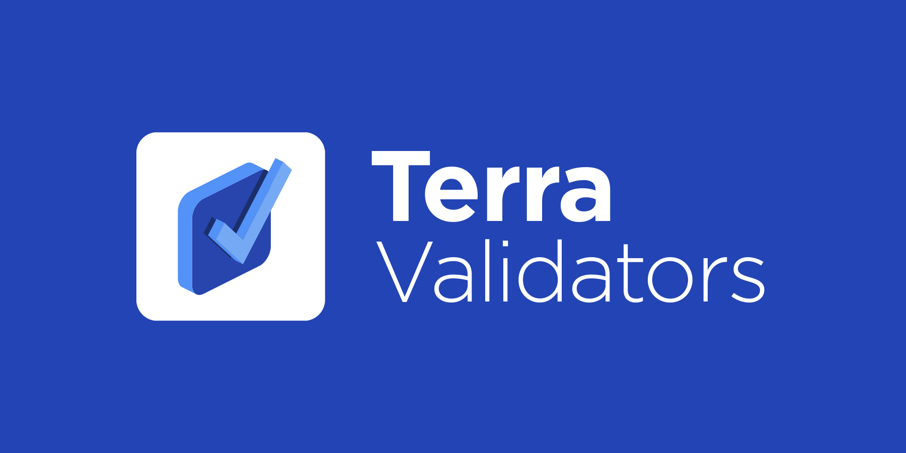

## Validator Directory

_NOTE: Validators that have yet to put up a profile have been hidden. Get the full list of validators [here](https://station.terra.money/staking)_

| Moniker               |                                                                                       |                                                                                                           |
|-----------------------|---------------------------------------------------------------------------------------|-----------------------------------------------------------------------------------------------------------|
| 01node.com            | [Profile](./validators/terravaloper1khfcg09plqw84jxy5e7fj6ag4s2r9wqsgm7k94/README.md) | [Station Page](https://station.terra.money/validator/terravaloper1khfcg09plqw84jxy5e7fj6ag4s2r9wqsgm7k94) |
| Arrington XRP Capital | [Profile](./validators/terravaloper1c6gve6zhye5690563wxmvns7mugz6plu4aj7d3/README.md) | [Station Page](https://station.terra.money/validator/terravaloper1c6gve6zhye5690563wxmvns7mugz6plu4aj7d3) |
| ATEAM                 | [Profile](./validators/terravaloper1tusfpgvjrplqg2fm7wacy4slzjmnzswcfufuvp/README.md) | [Station Page](https://station.terra.money/validator/terravaloper1tusfpgvjrplqg2fm7wacy4slzjmnzswcfufuvp) |
| B-Harvest             | [Profile](./validators/terravaloper15zcjduavxc5mkp8qcqs9eyhwlqwdlrzy6jln3m/README.md) | [Station Page](https://station.terra.money/validator/terravaloper15zcjduavxc5mkp8qcqs9eyhwlqwdlrzy6jln3m) |
| Bi23 Labs             | [Profile](./validators/terravaloper1jsdfyz8uhw2nd7cl45709w40r268phmvxam8eh/README.md) | [Station Page](https://station.terra.money/validator/terravaloper1jsdfyz8uhw2nd7cl45709w40r268phmvxam8eh) |
| Big Cat               | [Profile](./validators/terravaloper1k4ef8m95t7eq522evmmuzvfkpla04pezmu4j7k/README.md) | [Station Page](https://station.terra.money/validator/terravaloper1k4ef8m95t7eq522evmmuzvfkpla04pezmu4j7k) |
| block42               | [Profile](./validators/terravaloper16tc3c9u6yj5uuhru32pvs0pahfwraurpypz7vj/README.md) | [Station Page](https://station.terra.money/validator/terravaloper16tc3c9u6yj5uuhru32pvs0pahfwraurpypz7vj) |
| BTC.Secure            | [Profile](./validators/terravaloper1ya23p5cxtxwcfdrq4dmd2h0p5nc0vcl96yhjra/README.md) | [Station Page](https://station.terra.money/validator/terravaloper1ya23p5cxtxwcfdrq4dmd2h0p5nc0vcl96yhjra) |
| ChainLayer            | [Profile](./validators/terravaloper1kgddca7qj96z0qcxr2c45z73cfl0c75paknc5e/README.md) | [Station Page](https://station.terra.money/validator/terravaloper1kgddca7qj96z0qcxr2c45z73cfl0c75paknc5e) |
| Chorus One            | [Profile](./validators/terravaloper15urq2dtp9qce4fyc85m6upwm9xul30496sgk37/README.md) | [Station Page](https://station.terra.money/validator/terravaloper15urq2dtp9qce4fyc85m6upwm9xul30496sgk37) |
| DELIGHT               | [Profile](./validators/terravaloper1fjuvyccn8hfmn5r7wc2t3kwqy09zzp6tyjcf50/README.md) | [Station Page](https://station.terra.money/validator/terravaloper1fjuvyccn8hfmn5r7wc2t3kwqy09zzp6tyjcf50) |
| DokiaCapital          | [Profile](./validators/terravaloper1v5hrqlv8dqgzvy0pwzqzg0gxy899rm4kdur03x/README.md) | [Station Page](https://station.terra.money/validator/terravaloper1v5hrqlv8dqgzvy0pwzqzg0gxy899rm4kdur03x) |
| DSRV - CHAISCAN.com   | [Profile](./validators/terravaloper175hhkyxmkp8hf2zrzka7cnn7lk6mudtv4uuu64/README.md) | [Station Page](https://station.terra.money/validator/terravaloper175hhkyxmkp8hf2zrzka7cnn7lk6mudtv4uuu64) |
| Figment Networks      | [Profile](./validators/terravaloper15cupwhpnxhgylxa8n4ufyvux05xu864jcv0tsw/README.md) | [Station Page](https://station.terra.money/validator/terravaloper15cupwhpnxhgylxa8n4ufyvux05xu864jcv0tsw) |
| Forbole               | [Profile](./validators/terravaloper1jkqr2vfg4krfd4zwmsf7elfj07cjuzss30ux8g/README.md) | [Station Page](https://station.terra.money/validator/terravaloper1jkqr2vfg4krfd4zwmsf7elfj07cjuzss30ux8g) |
| FRESHLUNA             | [Profile](./validators/terravaloper1audgfvmgt0js54p3s8kj3r40uwej6vy2tv6rrw/README.md) | [Station Page](https://station.terra.money/validator/terravaloper1audgfvmgt0js54p3s8kj3r40uwej6vy2tv6rrw) |
| HashQuark             | [Profile](./validators/terravaloper13ww603e55suhavpuyjft3htxca6g4tldt92pgf/README.md) | [Station Page](https://station.terra.money/validator/terravaloper13ww603e55suhavpuyjft3htxca6g4tldt92pgf) |
| Heavy Metal Finland             | [Profile](./validators/terravaloper1xetqge5kmatfk6223hcfgf8z3tnukmjhrewxru/README.md) | [Station Page](https://station.terra.money/validator/terravaloper1xetqge5kmatfk6223hcfgf8z3tnukmjhrewxru) |
| HuobiPool             | [Profile](./validators/terravaloper12kfeqrflptmlz5qj8agrm2ze6dzss3crm7uevf/README.md) | [Station Page](https://station.terra.money/validator/terravaloper12kfeqrflptmlz5qj8agrm2ze6dzss3crm7uevf) |
| InfStones             | [Profile](./validators/terravaloper1u3gcqh4xqcdfkcu82nrk9u75x8vtvcz7xafgpy/README.md) | [Station Page](https://station.terra.money/validator/terravaloper1u3gcqh4xqcdfkcu82nrk9u75x8vtvcz7xafgpy) |
| kytzu                 | [Profile](./validators/terravaloper1jyjg55hzsh0f4xymy0kuuan30pp4q75ruqmvyt/README.md) | [Station Page](https://station.terra.money/validator/terravaloper1jyjg55hzsh0f4xymy0kuuan30pp4q75ruqmvyt) |
| MissionControl        | [Profile](./validators/terravaloper1x4ce4fhqdnu8j7hrp64qmthumsvuhlq8y0kvx4/README.md) | [Station Page](https://station.terra.money/validator/terravaloper1x4ce4fhqdnu8j7hrp64qmthumsvuhlq8y0kvx4) |
| Marte Cloud           | [Profile](./validators/terravaloper1dg7zhmt4g4zq74y4tksq4xfzf5pwx4cnngavjk/README.md) | [Station Page](https://station.terra.money/validator/terravaloper1dg7zhmt4g4zq74y4tksq4xfzf5pwx4cnngavjk) |
| Mosaic                | [Profile](./validators/terravaloper15s5d4lm0n75af9jxwawqzl73trnrypdslajxz4/README.md) | [Station Page](https://station.terra.money/validator/terravaloper15s5d4lm0n75af9jxwawqzl73trnrypdslajxz4) |
| NEOPLY                | [Profile](./validators/terravaloper103ra79dl2un2ltknhyz7crm5y29g4vhmycfwv9/README.md) | [Station Page](https://station.terra.money/validator/terravaloper103ra79dl2un2ltknhyz7crm5y29g4vhmycfwv9) |
| Orbital Command       | [Profile](validators/terravaloper19hflr9ay8usqxsxm4zzrsxfy3xz7hp6kv4ydnd/README.md) | [Station Page](https://station.terra.money/validator/terravaloper19hflr9ay8usqxsxm4zzrsxfy3xz7hp6kv4ydnd) |
| POS Bakerz            | [Profile](./validators/terravaloper1nwrksgv2vuadma8ygs8rhwffu2ygk4j24w2mku/README.md) | [Station Page](https://station.terra.money/validator/terravaloper1nwrksgv2vuadma8ygs8rhwffu2ygk4j24w2mku) |
| RockX                 | [Profile](./validators/terravaloper1aw0znxtlq0wrayyz7wppz3qnw94hfrmnnrcxja/README.md) | [Station Page](https://station.terra.money/validator/terravaloper1aw0znxtlq0wrayyz7wppz3qnw94hfrmnnrcxja) |
| Smart Stake           | [Profile](./validators/terravaloper1alpf6snw2d76kkwjv3dp4l7pcl6cn9uyt0tcj9/README.md) | [Station Page](https://station.terra.money/validator/terravaloper1alpf6snw2d76kkwjv3dp4l7pcl6cn9uyt0tcj9) |
| SolidStake            | [Profile](./validators/terravaloper1fhx7y75643tze8dxf4m9gwhkxn955q8r7vxjel/README.md) | [Station page](https://station.terra.money/validator/terravaloper1fhx7y75643tze8dxf4m9gwhkxn955q8r7vxjel) |
| StakeSabai            | [Profile](./validators/terravaloper1g6g0v23c6tv75ygk5za4s2ewwestdfj0k2cy2x/README.md) | [Station page](https://station.terra.money/validator/terravaloper1g6g0v23c6tv75ygk5za4s2ewwestdfj0k2cy2x) |
| StakeWith.Us          | [Profile](./validators/terravaloper1c9ye54e3pzwm3e0zpdlel6pnavrj9qqvq89r3r/README.md) | [Station Page](https://station.terra.money/validator/terravaloper1c9ye54e3pzwm3e0zpdlel6pnavrj9qqvq89r3r) |
| Staked                | [Profile](./validators/terravaloper1h6rf7y2ar5vz64q8rchz5443s3tqnswrpf4846/README.md) | [Station Page](https://station.terra.money/validator/terravaloper1h6rf7y2ar5vz64q8rchz5443s3tqnswrpf4846) |
| Staker Space          | [Profile](./validators/terravaloper1pc0gs3n6803x7jqe9m7etegmyx29xw38aaf3u7/README.md) | [Station Page](https://station.terra.money/validator/terravaloper1pc0gs3n6803x7jqe9m7etegmyx29xw38aaf3u7) |
| Stakin                | [Profile](./validators/terravaloper1nwrksgv2vuadma8ygs8rhwffu2ygk4j24w2mku/README.md) | [Station Page](https://station.terra.money/validator/terravaloper1nwrksgv2vuadma8ygs8rhwffu2ygk4j24w2mku) |
| Staking Fund          | [Profile](./validators/terravaloper123gn6j23lmexu0qx5qhmgxgunmjcqsx8gmsyse/README.md) | [Station Page](https://station.terra.money/validator/terravaloper123gn6j23lmexu0qx5qhmgxgunmjcqsx8gmsyse) |
| syncnode              | [Profile](./validators/terravaloper1sym8gyehrdsm03vdc44rg9sflg8zeuqwfzavhx/README.md) | [Station Page](https://station.terra.money/validator/terravaloper1sym8gyehrdsm03vdc44rg9sflg8zeuqwfzavhx) |
| Synergy Nodes         | [Profile](./validators/terravaloper12jpzzmwthrljcvm48adncspxtchazkl8vah7u4/README.md) | [Station Page](https://station.terra.money/validator/terravaloper12jpzzmwthrljcvm48adncspxtchazkl8vah7u4) |
| Terran One            | [Profile](./validators/terravaloper1krj7amhhagjnyg2tkkuh6l0550y733jnjnnlzy/README.md) | [Station Page](https://station.terra.money/validator/terravaloper1krj7amhhagjnyg2tkkuh6l0550y733jnjnnlzy) |
| TERRA-FIRMA           | [Profile](./validators/terravaloper1qqu376azltyc5wnsje5qgwru5mtj2yqdhar97v/README.md) | [Station Page](https://station.terra.money/validator/terravaloper1qqu376azltyc5wnsje5qgwru5mtj2yqdhar97v) |
| setten.io             | [Profile](./validators/terravaloper1tdkh85vv7vsvav93elmx6qsywuu22amc60u3sa)           | [Station Page](https://station.terra.money/validator/terravaloper1tdkh85vv7vsvav93elmx6qsywuu22amc60u3sa) |
| StakeTo.Me            | [Profile](./validators/terravaloper1z7we2y02fy2kvw0tdq8k26j4t370n58wxvl4ge)           | [Station Page](https://station.terra.money/validator/terravaloper1z7we2y02fy2kvw0tdq8k26j4t370n58wxvl4ge) |

## What is a Validator Profile?

As a validator, it's not enough to maintain rock-solid, reliable infrastructure -- you also need to market yourself effectively and court delegations from prospecting delegators. Validator Profiles, hosted here on this Github repository give you a platform to give potential delegators and clients a brief introduction on your team, philosophy, architecture and infrastructure, and present your ecosystem contributions. If you need vouching from us, we'll apply a badge for any claims that we can validate.

## How to change your Validator Profile

1. Fork this repository to your own GitHub account.

2. Clone the repo from your own account. Make sure you clone the repository from your account (your fork), NOT the original repo.

```sh
git clone git@github.com:xxxxxx/validator-profiles.git
cd validator-profiles/
```

3. Create a new branch and switch to a new branch by your validator name. For example:

```sh
git checkout -b Wraith-profile
```

4. Copy the template [README.md](./template/README.md) and [JSON Profile](./template/profile.json) into your folder inside `validators/<your-valoper-address>`.

5. Change the contents and add your information as necessary. You can modify anything within your own designated validator folder, including adding image files, new folders, etc.

6. Commit and push the information to your repo.

```sh
git add -A
git commit -m "Edit Wraith profile"
git push origin Wraith-profile
```

7. Under your repo page, click the “New pull request” button. Make a Pull Request with our repository with a summary of changes.

8. We will review your PR as soon as possible. If there is no problem with your PR, we will merge it into our master branch, which will update your Validator Profile. If it is your first time creating a profile, we will add your entry to the [Validator Directory](#validator-directory).

### profile.json

Registered validators (validators who have submitted a profile) can opt-in to receive support from Terra by putting their contact information in `profile.json`. Terra provides various validator-support such as automatic notifications when your validator is missing blocks or oracle votes.

```javascript
{
    "contact": { // contact info for delegators / outreach
        "email": "validator@example.com",
        "telegram": "@validator"
    },
    "notifications": { // notification settings
        "email": "technicalemail@example.com" // email to receive notifications
    }
}
```
