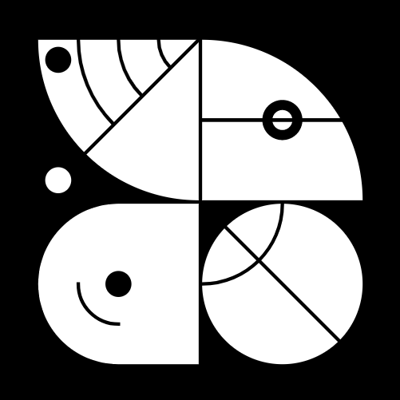

 
 
# <moniker> 
Tendermint-based chains validator.
 
## Team

Wave is a team of 3 engineers structured arround a Dev Ops, a BackEnd Engineer and a Tech lead. We believe that the anonymity is stronger and more resilient than the reputation in many aspects of the blockchain world.

| Name            | Role    | 
| --------------- | ------- | 
| Abef            | CTO     | 
| Maxime S.       | DevOps  | 
| Matthieu M.     | Backend | 

## Our Architecture

We are sticking to the best practice with Sentries → relay nodes → validator → HSM. Our main infra is deployed in Google Cloud, our backup infra is OVH.
Prometheus analytics, Prometheus node exporter, grafana and others script for DDOS mitigation and reporting tools.

## Ecosystem Contributions

Actives members of many tendermint based chain. We don’t abstain on governance proposal and discuss the tradeoff of each proposal for the networks we are validating. 
We are using an independent oracle server.

## Contact Us

The best way to have a quick answer is: Discord: @Waves#9228 or Telgram: @WaveWays

### Website

https://bity.hns.to/
