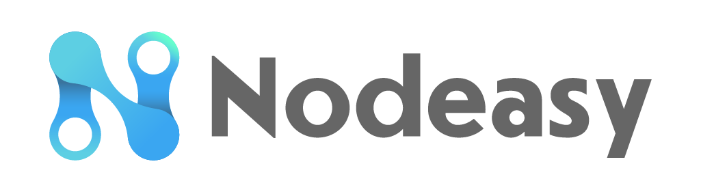

---
Moniker:Nodeasy
Validator:terravaloper12qvrr6j7u3z5el5uuwg99ftx3jru5py6027gfx
Email:wenzhihao@bitopia.cn
Telegram:@xiehuangcandou
Twitter:@Nodeasy
Website: https://www.nodeasy.com
---

## Team

Nodeasy.com is a Staking Economy portal from China, providing one-stop blockchain staking on-chain data, public chain node construction technology, node operation and maintenance and operation services; at the same time, Nodeasy is also a comprehensive domestic blockchain staking Data providers and node service providers. 

## Community

Nodeasy.com is an Staking Economy Portal and DeFi in China, we provide precisely statistics info about POS and MN projects. We have our own blockchian media, mining pool, validators. We have our own QQ group, Wechat group with more than 40,000 readers, 5,000 staking fans and more than 30 KOLs in Chinese blockchain media. Currently Nodeasy is validator on Cosmos, Terra, Near, Polkadot, Avax, Oasis, Mina, Nucypher, Graph, Certik, Horizen, Kusama, Stafi, Darwinia, Harmony, Irisnet, IoTeX, IOST, EOSForce and so on.

## Contact Us

You can reach us:

- Email: wenzhihao@bitopia.cn
- Telegram: @xiehuangcandou

## Website

https://www.nodeasy.com
