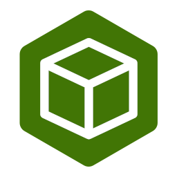

# StakeBin

Safe and reliable validator on Terra. We run analytics dashboard for terra and ecosystem projects. We have been a validator on the terra network since March 2021 without a single slashing/jail event

## Our Architecture

We use multiple containers and hardened images to safeguard the validator and other components. Sentries are used for network redundancy. We are in the process of migrating some of our infra to self-hosted servers. We will eventually have a semi-cloud & semi-self-hosted infra with the capability to completely move towards self-hosted infra on short notice (if the need arises)

## Ecosystem Contributions

We plan to contribute more towards terra ecosystem

- Terra and ecosystem analytics dashboard at https://terra.stakebin.io

## Contact Us

Have questions? You can reach us:

- Telegram: https://t.me/StakeBin
- Twitter: https://twitter.com/StakeBin
- Email: contact@stakebin.io
- Website: https://terra.stakebin.io
- Discord: https://discord.gg/KTKc33PRev
