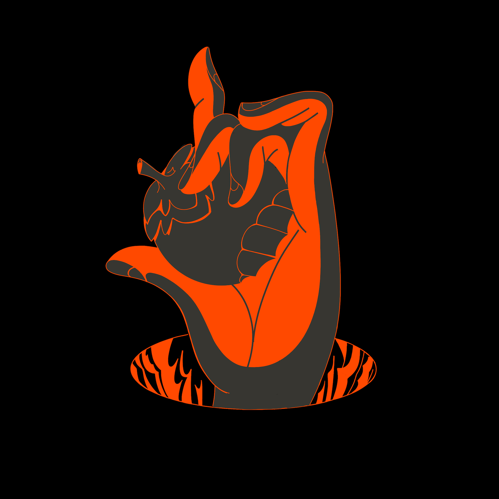

Web3 Syndicate and Infrastructure
Web3 projects are being built and driven by a devoted community of 
builders, power users, and tinkerers. Loyal users are flowing in behind 
them because of the favorable incentive mechanisms built around these 
projects. Project tokenomics are creating new business models, and DeFi, 
NFTs, and DAOs are some of the early building blocks that are using these 
new business models to deliver utility to end users via smart contracts 
that are composable and scalable. When this sort of intersection between 
builders, devoted communities, and incentives happens, the result will 
certainly always be new paradigms.

## Contact Us

Should you have any questions, comments or concerns, you can always reach 
us at:

- Discord: https://discord.gg/CqwEwHMu
- Twitter: [@0xgidorah](https://twitter.com/0xgidorah)
- Email: validator@gidorah.xyz
- Website: https://https://www.gidorah.xyz/

