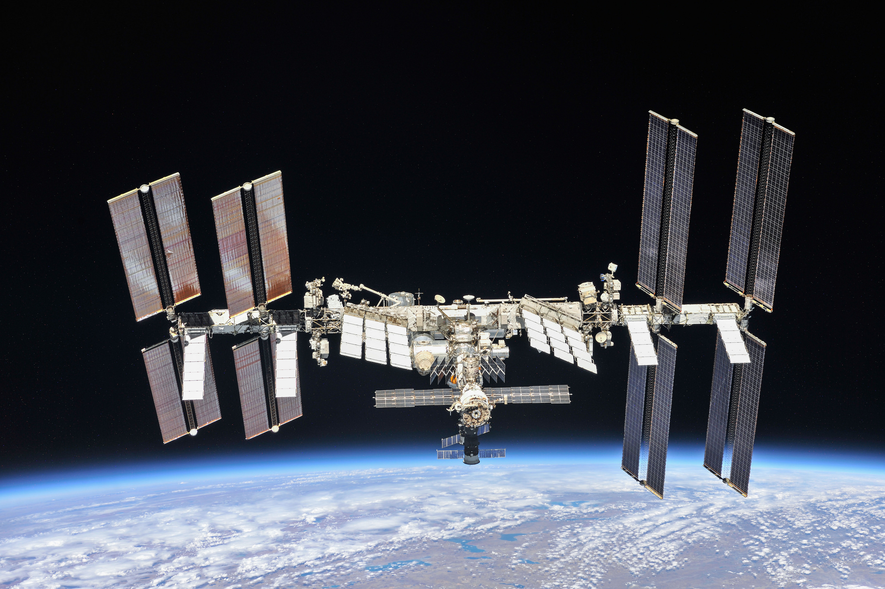

 

#  ISS - International Staking Solutions

International Staking Solutions is an experienced team of individuals supporting decentralized blockchains worldwide.

While we often stay out of the spotlight, we're always overhead observing and ready to support projects with technical assistance and node operations. As active developers and investors of blockchain projects and try and keep the focus on the chains and projects instead of ourselves or our node.  

We are here to operate the chain and do it well.  ISS was a validator on the classic blockchain and still supports both chains as we see no reason for competition or division. 

"It's really nice up here..."
- Speceman Rocko  | CTO    

### On Architecture & Governance

Our node architecture was created based on extensive experience with Cosmos based blockchains. We have a history of operating high availability and efficient nodes. We also try and keep our comissions as low as we can. Our uptime and history for Terra can be viewed on-chain.

On governance we prefer if our stakers vote their own stakes. That's better than giving your voting power to us by default.  But we vote on important issues as well as participate in important governance discussions.

#### Need Support?

We can be reached on Discord: Herr_Rocko|ISS#8625 or telegram: @spacerocko

