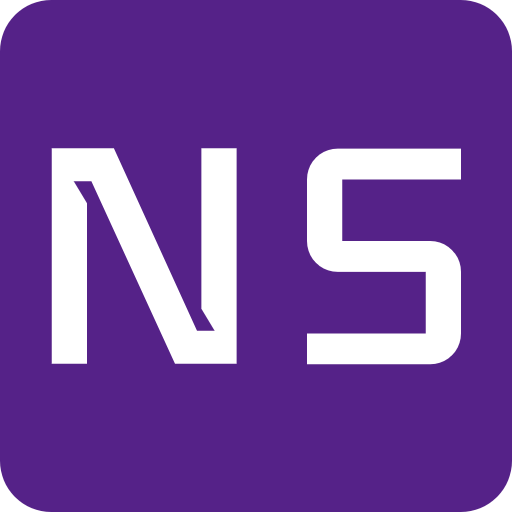

Nitawa Systems is a group of Systems Administrators and Developers with a strong focus on building infrastructures of blockchain and development tools. We have successfully run multiple validator nodes already, adopting enterprise-grade infrastructure practices to make sure the services are safe, stable and resilient. We keep information security at the heart of what we do and set the bar for enterprise-grade security and back up systems.

## Team
Our team is composed of highly experienced Systems Administrators and Developers. 

| Name      | Role                |
| --------- | ------------------- |
| Arman    | Co-Founder          |
| Reba   | Co-Founder          |

Visit our website to read more information on our team.

## Contact Us

Have questions? You can reach us:

- Telegram: https://t.me/nitawa_systems
- Twitter: @nitawa_systems
- Email: arman@nitawa.com
- Website: https://nitawa.com

