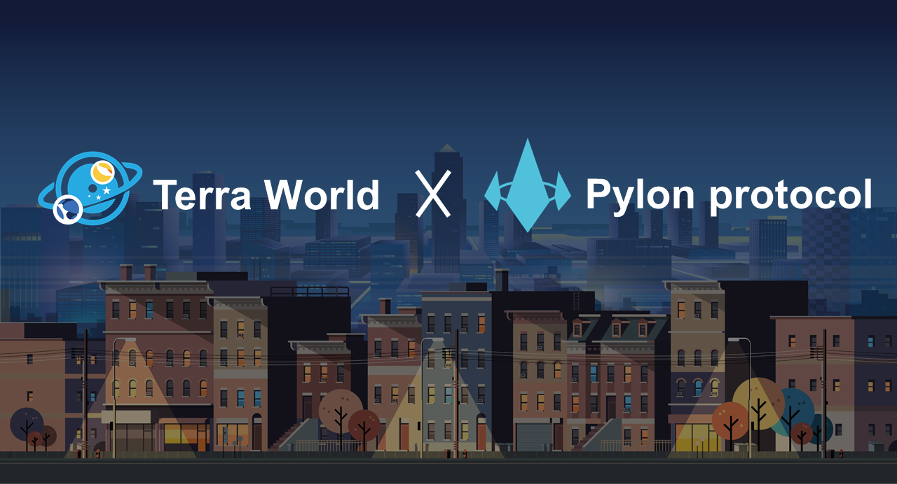

Terra World is a first metaverse for working service powered by terra, provides a distinct remote work environment for business. Terra World is designed to attract business people, workers and, startup founders who seek low-risk investments. Anyone can create their own businesses using Terra World and experiment with their ideas in any way they want.

## What Exactly Can You Do?
Terra World is a metaverse that utilizes the Terra ecosystem where accounts are created using a Terra chain wallet. Once their account is created, the user can create an individual character to perform various activities within the world. Terra World features customizable avatars, access to Terra assets, and full anonymity. Additionally, users are provided with a messenger connected to a Terra wallet. Even if a user isn’t currently active within the world, they can receive all of the benefits of Terra World through this messenger. These benefits include Terra transactions, airdrop events, sponsorships, and other social or commercial activities using the Terra chain.

## Contact Us

- Telegram: https://t.me/twdoffice
- Twitter: https://twitter.com/terraworld_work
- Medium: https://medium.com/terraworld
- Website: https://terraoffice.world/
- Email: TerraWorld@terraoffice.world
