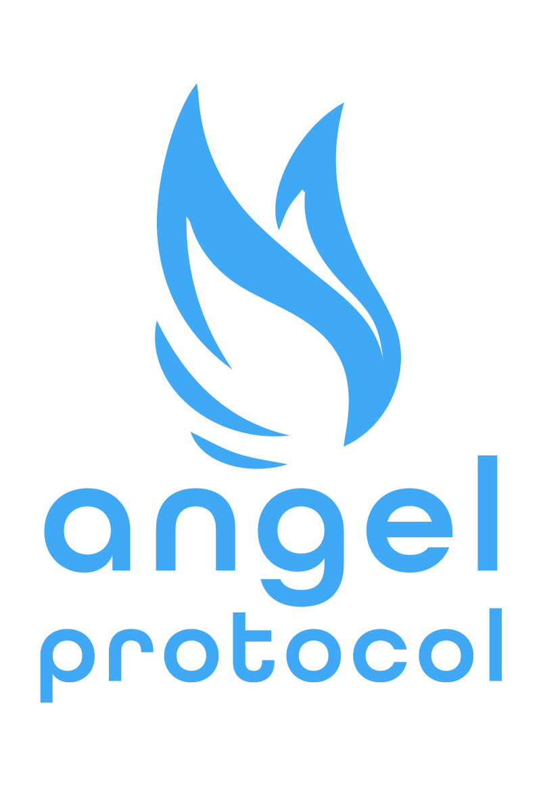
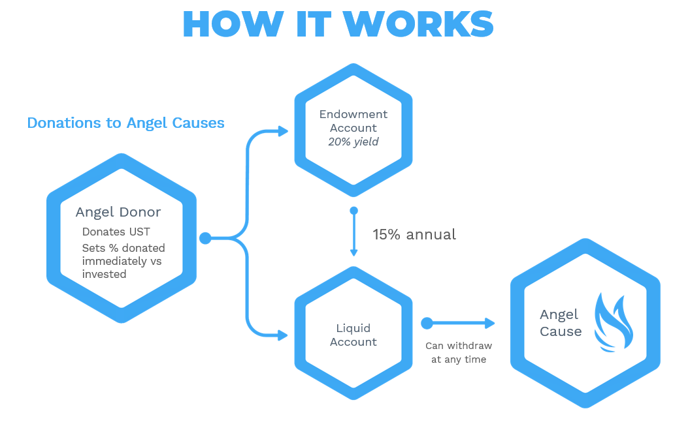
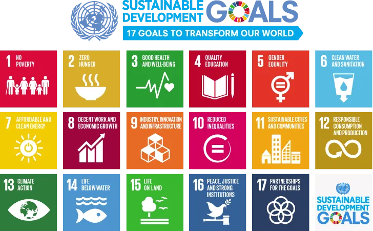
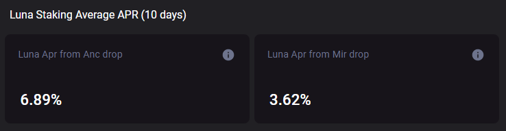
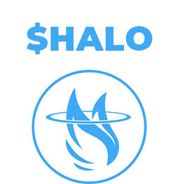
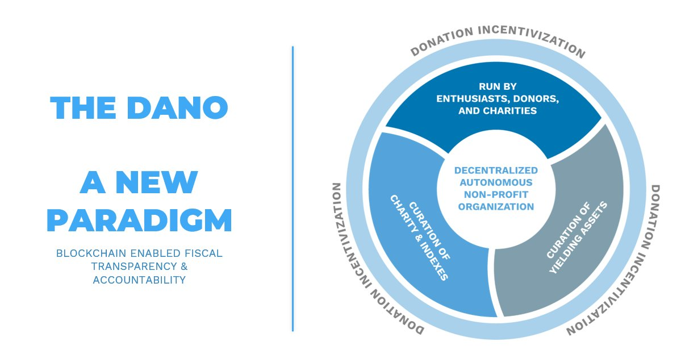
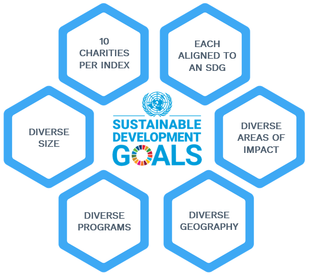
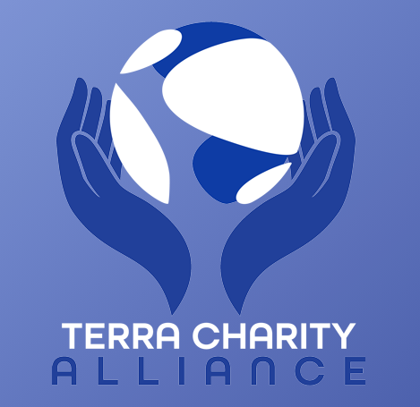
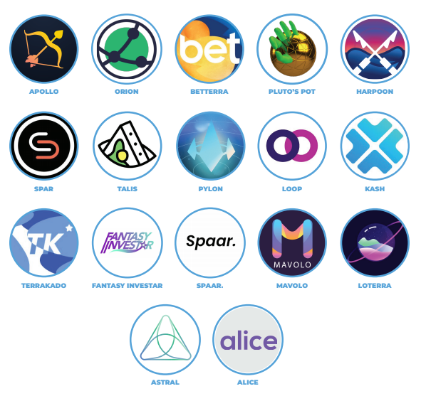

  

# Angel Protocol: Building A World Where All Charities Are Financially Free

Our mission is to create easily accessible charity endowments powered by DeFi yield such as [Anchor Protocol’s 20% ‘Earn’](https://www.learn-terra.com/anchor-protocol) functionality. By leveraging compound interest and smart contracts, we're able to ensure donations last forever and grow in perpetuity, providing financial sustainability for non-profits. Give once, give forever.

Angel Protocol enables charities to get a better return on their deposits, and donors get to know their money is being put to more efficient use. We abstract away the complexity of crypto for the everyday user and provide a simple, frictionless interface. Our team is backed by over 60 years of non-profit experience, including the founder of [Global Brigades](https://www.globalbrigades.org/).

[Medium Overview Article](https://angelprotocol.medium.com/angel-protocol-redefining-social-giving-ffd4e5b561b5)

## Validator Purpose

The Angel Protocol Validator will serve as a crowdfunding source for $LUNA holders eager to support our shared vision. Commission will be set to 100%, with any funding above operating expenses reinvested into charity indexes aligned with the UN Sustainable Development Goals: [https://sdgs.un.org/goals](https://sdgs.un.org/goals)

 

 

As an Angel Protocol delegator, you will be donating your base $LUNA yield, but not your airdrops. Of the average ~12% staking rewards, only ~2% is comprised of base yield, with the remaining ~10% made up of Mirror & Anchor airdrops that you will continue to enjoy.

[https://terra.smartstake.io/stats](https://t.co/Qje3D1L1uI?amp=1)

 

 

You will also continue to receive all upcoming protocol airdrops, as well as being rewarded with a dedicated $HALO airdrop in the future as a thank you for your support! $HALO will be awarded in proportion to the amount and duration of staking.

 

 

Please note you do not need to un-delegate or wait 21 days. Simply locate the Angel Protocol validator, click Delegate, and choose your source; you will be able to redelegate from there.

Thank you for your support. We're nothing without the [@terra_money](https://twitter.com/terra_money) community!

## Validator Technical Details

Angel Protocol provides validator services in partnership with Bison Trails. Their protocol specialists and engineers work closely with Terra, testing network upgrades and running the public Terra validators to support the foundation.

With this partnership we are able to provide a 99% uptime guarantee, and can ensure our Terra node stays active and secure with multi-cloud/multi-regional distribution, enterprise grade security management, and real time data & analytics.

## Transparency

Transparency is central to our Decentralized Non-Profit Autonomous Organization (DANO) ethos. Our Terrastation wallet is public & tied to our validator: terra1g0uzl468etgkx0gkts42mg7ly6waqkemw89lsh

Funds will first be used to cover build and operating expenses, with any excess going to public charity wallets, all on-chain.

 

 

To equitably distribute funds from our validator & [Terra Charity Alliance](http://terraalliance.io) members, our 17 UN SDG indexes will be comprised of 10 charities each, representing a diverse mix of sizes/regions/types. These will be vetted by ourselves as well as an aggregation of charity watchdog groups.

 

 

After a given index reaches a set donation amount (e.g. $10,000 $UST), it will rotate to the next index in the list. The charities in each index will be partially determined through public community voting at first, and governed by a community DANO in the future.

By distributing $HALO to Angel Protocol delegators (as well as a smaller proportion to all $LUNA delegators), governance rights in the world's first decentralized, autonomous, non-profit organization will be given to the [@terra_money](https://twitter.com/terra_money) community with a constant donation stream from the [Terra Charity Alliance](http://terraalliance.io) protocols.

 

 

 

[@terra_money](https://twitter.com/terra_money) is *the* blockchain for charity. It's quite literally coded into our smart contract DNA. And together, we will create and govern the world's largest and most effective community owned non-profit, entirely on-chain.

### Additional Viewing

Validator Introduction:

[https://www.youtube.com/watch?v=681QZf_FlcI](https://www.youtube.com/watch?v=681QZf_FlcI)

Angel Protocol Introduction:

[https://www.youtube.com/watch?v=Tv2ECcdPqzY](https://www.youtube.com/watch?v=Tv2ECcdPqzY)

TerraBites Interview:

[https://youtu.be/53GM4uSR_NI](https://youtu.be/53GM4uSR_NI)

### Contact Us

[hi@angelprotocol.io](mailto:hi@angelprotocol.io)

[Twitter](https://twitter.com/angelprotocol) — Share the buzz

[Telegram](https://t.me/angelprotocoI) — Join the conversation

[Website](https://angelprotocol.io) - Find out more