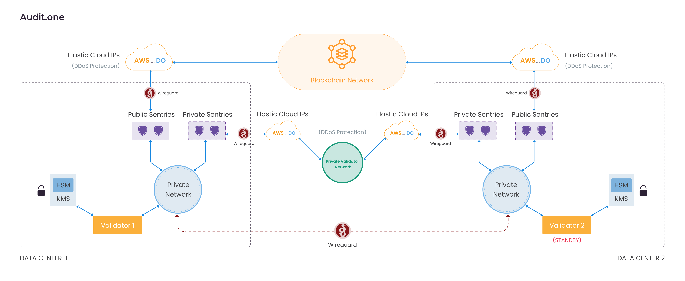

# AUDIT.one

## About us

Even though the concept of Blockchain is new to the world, it is a continuation of a very human story. Humans have always found ways to reduce uncertainty. We rely on third parties today to reduce uncertainty whereas blockchain reduces uncertainty with the help of pure mathematics. At AUDIT.one, we are firm believers in the future of Decentralization. We believe that The Validators of today will be the Auditors of tomorrow. We run Validators for networks that we genuinely believe in and contribute to the growth of these networks in every possible way.

## Team

We are a team of experienced professionals that believe in doing things in a decentralized way. Our team consists of experts with real-world experience in building blockchain systems, DevSecOps, and Security testing

## Operations and Architecture

We have a highly redundant setup with self-hosted data centers across multiple geographical locations.

We have a deep understanding of the importance of having a fault-tolerant and attack resistant setup and use tap into Public clouds to fend off DDoS attacks and have real-time alerting and monitoring solutions that keep us ahead in the game.

We are proud supporters of the DPoS ecosystem and we run Validators for the following networks:

- Cosmos Network
- Terra
- IRIS Network
- Matic Network
- Persistence

## Contact us

You can reach out to us on

- Email: hello@audit.one.
- Telegram: @auditone
- Website: https://audit.one/
