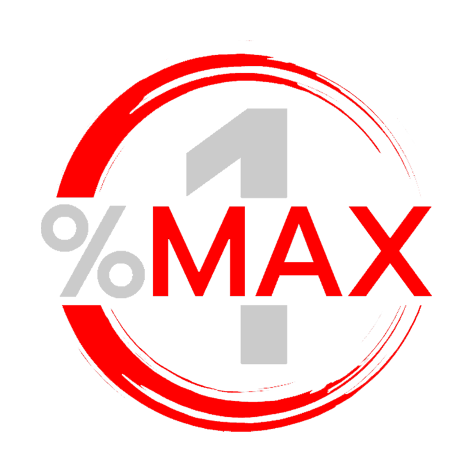

  

# Orion.Money

We are community centric validator that shares its full commission net revenue with our token stakers. To learn more please visit us at https://orion.money

## Our Architecture

We currently have 3 dedicated physical servers located in 3 different data-centers. One is active validator, two others - just the nodes which have the recent state of the block-chain, so in case of failure of one we could switch to the another node. No plans to run nodes on other blockchains for now, all servers are used as terra validators/nodes only.

We are constantly monitoring servers. If some goes down will be able to restart node on another one. No sentry nodes for now.

## Ecosystem Contributions

Orion Money is building a portfolio of dApps and infrastructure on and off the Terra network, which will open floodgates of new users and capital into the Terra ecosystem.

Our first product - Orion Saver - is an easy-to-use dApp that helps Ethereum-based stablecoins (USDT, USDC, Dai) to benefit from Anchor’s 20% APY and offers an even higher return to Orion token holders. All without having to leave the Ethereum network.

We believe there exists a vast untapped opportunity with Anchor and Terra and want to bring the Anchor savings with Orion’s added value to as many people as possible.
