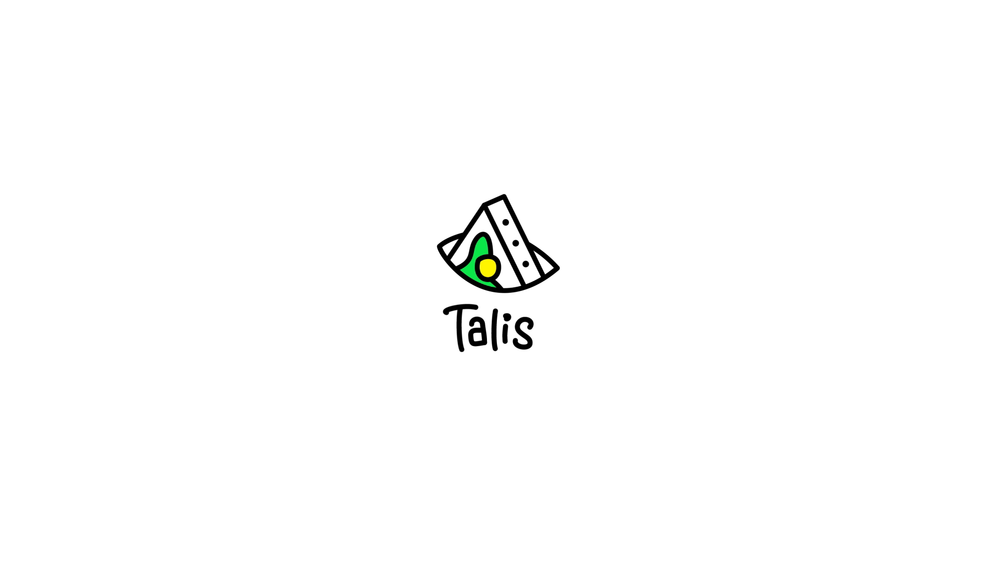

  

# Talis Protocol

Thanks to Blocbits, Talis had the opportunity to launch its own validator in order to participate in the conjoint effort to decentralize and stregthen the protocol, as much as inheriting and earning from the Proof of Stake model. 
This model, the Tendermint one, is philosophically a core principle for Terra’s ecosystem and by extension for Talis.

All proposals, prior to vote and as a community, will be discussed on our Telegram group (https://t.me/talisprotocol) and we invite every Talis staker to head-up here to discuss Governance’s proposals. 

We'll keep our commission fee percentage as null until releasing our Genesis Airdrop.
From there we'll increment steadily up to 3% in Q1 2022 and 5% in Q2 2022.

## Our Architecture

Our validator uses a redundant architecture using both Google and AWS.

## Ecosystem Contributions

https://talis.art/

## Contact Us

Have questions? You can reach us:

- Email: eloi@talis.art / leonard@talis.art
- Telegram: https://t.me/talisprotocol

## Website

Website : https://talis.art