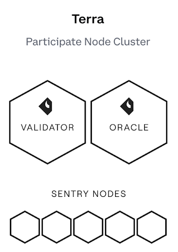

  

## Team

Coinbase Cloud (f.k.a. Bison Trails) provides secure and reliable blockchain infrastructure and APIs. Stake your crypto to our enterprise-grade validators.

## Our Architecture

Sentry Nodes → Validator + Oracles

We support both AWS and GCP cloud regions and we use a multitude of internal tools to closely monitor the health of our nodes. We’re node, participatory infrastructure, and protocol experts.

## Ecosystem Contributions

Our team are active members within the Cosmos Ecosystem and frequently participate in governance.

## Contact Us

Please reach out to us at team.tendermint@coinbase.com.

### Website

Visit us at https://coinbase.com/cloud
