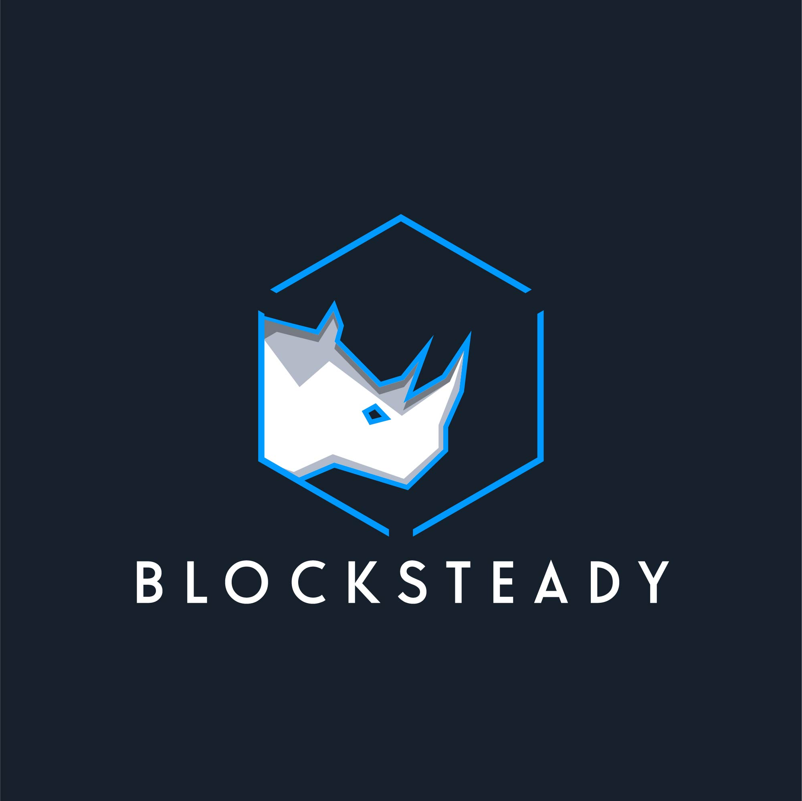

 

# <moniker> 
blocksteady run nodes on the networks they believe to be the cornerstones of what will be our decentralised future. 

## Team
Currently we are a single person team but looking to expand our operations as we bring ourselves online with more networks. Dan has an extensive background in IT with experience with operating nodes in the blockchain space since 2018. 

| Name            | Role    | 
| --------------- | ------- | 
| Dan            | Director/DevOps     | 

## Our Architecture

Our infrastructure is currently hosted on servers with the following specs (16 core, 128gb ram, 2x3.84 NVME SSD). We are in the process of procuring hardware of our own to operate from a data centre in Melbourne, Australia to further decentralisation of the Terra network.

## Ecosystem Contributions

We are active members of the Luna community and participate in all governance proposals put forward to consideration to the network.

## Contact Us

The best way to contact us is via Discord: @dancube#8939

### Website

https://blocksteady.xyz/
