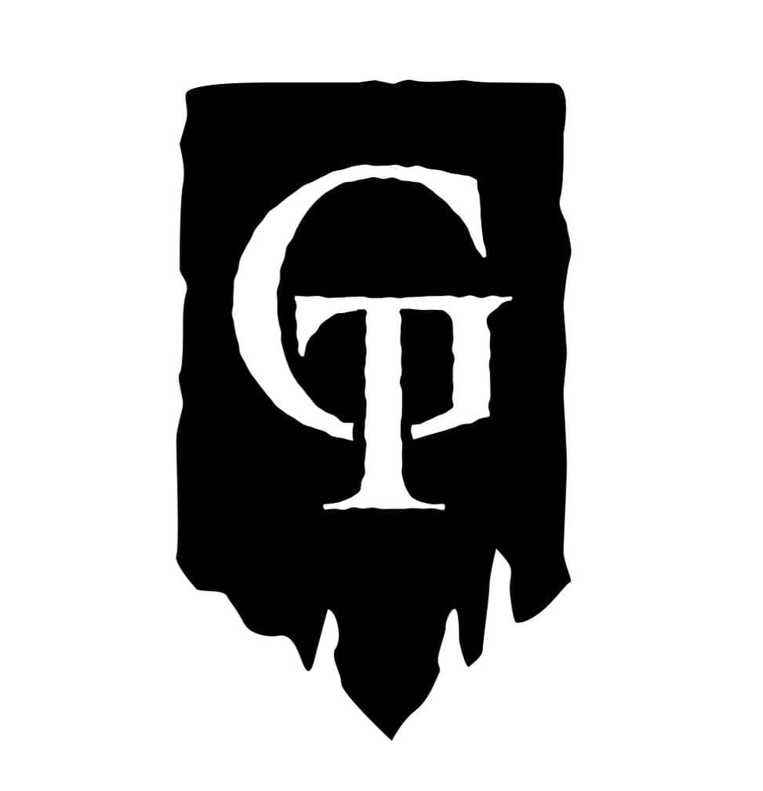

GT Capital is a staking validator that is built by LUNAtics for LUNAtics.  Our validator is powered by state of the art enterprise infrastructure which provides the reliability and security needed for the future of the Terra ecosystem.
 
GT Capital is more than just a staking validator.  It is important more now than ever especially as Luna continues to grow that there is active governance in proposals being put forth that impact the wider community. We promise to be active in all proposals and encourage a healthy debate amongst the community and validators to ensure the best path forward is discussed for all LUNAtics. We will always vote, we will not be a passive observer.
 
We are also working on building out some benefits for our stakers: - potentially a portion of any advisory tokens that GT receive when working with projects will be airdropped to our stakers - We are working on NFT concepts that could be dropped to GT delegators as well.
 
Please note that our ideas are still in the early stage of formation and still need to be built out, but we hope to be one of the most active community groups & validators on the Terra network & we hope that you will trust us with your delegations.

## Team
Our members are a range of individuals from prominent community members, project founders, ecosystem tooling, research analysts etc. You probably recognize some of them like Nick, Hyperion, Seb, Lunatic Hisoka, Jimmy Le, RyanLion, Terranaut and Cypher to name a few.
 
We want the best for Terra and helping secure the network is part of that mission. In addition to our most recent validator, we support the community with:
 
-   Recently acquiring and reinvigorating LUNAtics Telegram
-   Active engagement in community Discord and TG channels
-   AMAs to highlight the benefits of new Terra Projects
-   Job board to assist in hiring top tier talent at Terra Projects

## Contact Us

Should you have any questions, comments or concerns, you can always reach us at:

- Telegram: https://t.me/LUNAtics100x
- Twitter: [@gtcapital_](https://twitter.com/gtcapital_)
- Email: contact@gtcapital.io
- Website: https://gtcapital.io/
