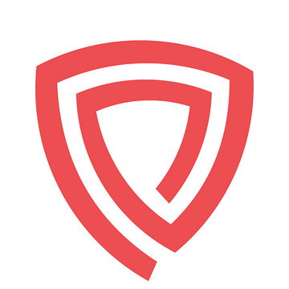

# SafePoint

Professional and reliable PoS validator. SafePoint is a team of experienced systems engineers that provides a high level of quality and reliability with focus on security.

## Team

| Name            | Role                | 
| --------------- | ------------------- | 
| Vic             | Co-Founder & DevOps | 
| Luca            | Co-Founder & DevOps |

## Our Architecture

We're running our main infrastructure in DC located in German. Our backup infrastucture, as well as validator-related services are running in AWS. To protect validator keys we use HSM. Our monitoring tools such as Prometheus, NewRelic, OpsGenie are always ready to alert us in case of emergency.

## Contact Us

The best way to have a quick answer is: 

- Telegram: [SafePointVD](https://t.me/SafePointVD)
- Discord: [Vic | SafePoint](https://discordapp.com/users/978526801800335403)
- Email: contact@safepoint.co
