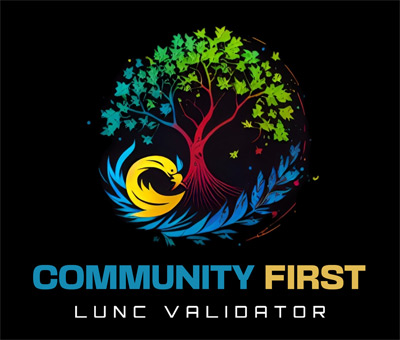

# Community First LUNC Validator

The Community First LUNC Validator is pro-community and pro-Binance. We want to give community members a voice, and we will vote to ensure that happens. Our community first stance also includes Binance, especially in regards to the support we have received. As a Validator, we understand that a truly decentralized environment may not be possible, but centralization within a mostly decentralized project provides the community with support, guidance, and a path forward.

## Our Goal

Our goal is to place our Community First by educating about governance issues and all matters LUNC. Our ethos is pro-Binance in recognition of their support for the blockchain.

## Our Team

We are a group of individuals that have come together to support the Luna Classic Community through a combination of voting, education, and charity. We are some of the Admins from the Binance & Lunc community Telegram group.

## Contact Us

We can be reached at the following:

- Telegram: https://t.me/+xQHXIemvaJY3ODhk
- Website: https://communityfirstlunc.com/
- Twitter: [@CommFirstLunc](https://twitter.com/CommFirstLunc)
- Email: CommunityFirstLUNC@gmail.com
