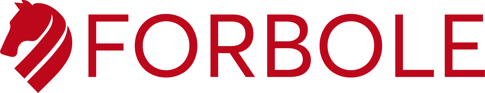

# Forbole

WE ARE VALIDATORS, BUILDERS AND CONTRIBUTORS.

Forbole is a Genesis Validator on Terra and Terra 2.0. We are a named winner in Game of Stakes and HackAtom3 by Cosmos. We are a very helpful contributor in both the English and Chinese community. Forbole is also the team behind the beloved opensourced block explorer - [Big Dipper](https://github.com/forbole/big-dipper) and the Cosmos SDK based decentralized social network - [Desmos](https://github.com/desmos-labs/desmos).

## Team

We operate in multiple time zones across the globe with multiple skillsets in network security, user experience, software engineering & community building.

| Name                                                | Role                           |
| --------------------------------------------------- | ------------------------------ |
| [Kwun Yeung](https://github.com/kwunyeung)          | Cofounder & CTO                |
| [Terence Lam](https://twitter.com/terencesflam)     | Cofounder & CEO                |
| [Shilin Zheng](https://twitter.com/Zheng_Shilin)    | Managing Director              |
| [Ravi Soni](https://github.com/rav-11)              | Infrastructure Lead            |
| [Charles Pusey](https://github.com/Blutacktack)     | Infrastructure Engineer        |
| [Muhammad Elsayeh](https://github.com/Sayeh-1337)   | Security & Blockchain Engineer |
| [Hiep Mai](https://github.com/maiquanghiep)         | DevOps Engineer                |
| [Ivan Lo](https://github.com/Naviolp)               | DevOps Engineer                |

## Our Architecture

Our validator node and key management system are operating securely in a TIA-942 Rated 3+ world-class data centre connecting to scalable sentries running across different cloud providers via VPN.

## Ecosystem Contributions

We are active members of the Terra community and different crypto channels in English and Chinese community. Our team speak six langauges which connect western and eastern crypto world.

## Contact Us

Have questions? You can reach us:

- Email: validator@forbole.com
- Telegram: https://t.me/forbole
- Twitter: https://twitter.com/forbole
- Github: https://github.com/forbole
- Medium: https://medium.com/forbole

### Website

https://www.forbole.com