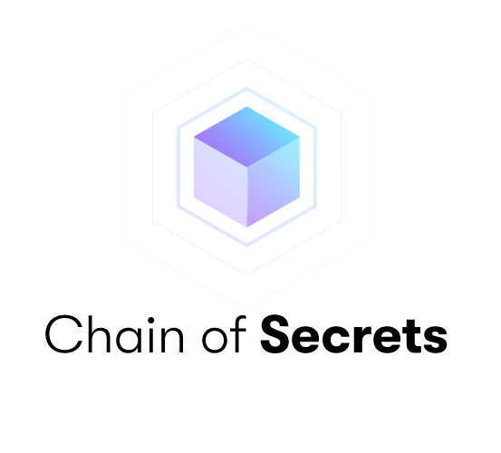

## Chain of Secrets

We are not just a validator, Chain of Secrets is a provider in affordable fully-compliant Intel SGX infrastructure to Blockchain Networks, Traditional Software Development Companies and Teams which require Enhanced Application Security through Intel SGX hardware. 

Chain of Secrets provides entire infrastructure bootstrapping from the ground up for all Intel SGX Blockchains in the world.

We are a team of technologists with backgrounds in security, networking, blockchain infrastructure, token economics, and decentralized finance.

## Team

The Followings are our members.

| Name            | Role               |
| --------------- | ------------------ |
| Dan Briggs      | CEO.   Founder     |
| Chris Rose      | Senior Devops      |

## Our Architecture

We own and operate all our own server and networking hardware outside of the centralized cloud. 
Operating our own cloud and racks in a Tier III datacenter, specifically chosen for redundancy. Our Architecture is truely decentralised!

## Contact Us

Have questions? You can reach us:

- Email: devops@chainofsecrets.org
- Telegram: @chainofsecrets

### Website

https://chainofsecrets.org/
