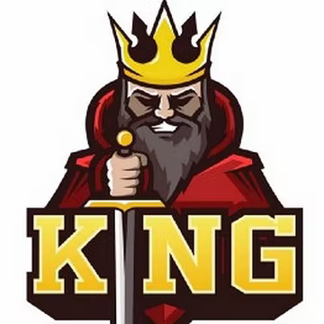

 

# KingSuper
We are a team of software developers and operate on 18 networks in total, some of them includes the graph protocol, mina, osmosis, agoric, umee, juno.

## Team

KingSuper is a team of 2 software engineers, who switched to blockchain world because we love web3. We believe that the anonymity is stronger and more resilient than the reputation in many aspects of the blockchain world.

## Our Architecture

We follow sentry architecture to avoid DDos attacks and use yubiHSM2 for signing blocks. We have strict policies in place for security measures. 
We have a grafana dashboard and a alerting setup in place so in case anything goes wrong we get a call.

## Ecosystem Contributions

We have contributed a lot to Cosmos ecosystem, Graph protocol,and Mina protocol. We are also a grant recipient from Graph protocol, Mina, Axelar, Umee, Aleo.
We host the governance alert bot and faucet bot for many cosmos based chains. Not only that we are technical moderators with Axelar and Umee. We helped them in conduction of their testnets

## Contact Us

The best way to have a quick answer is: Discord: @KingSuper#3702 or Telgram: @programming_lord

### Website

https://king.super.site
